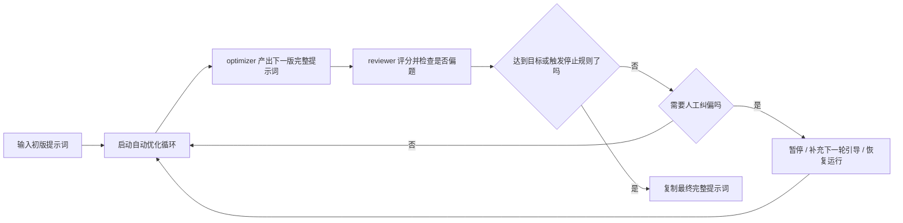

<p align="center">
  
</p>

# Prompt Optimizer Studio（提示词优化工作台）

**中文** | [英文](README_EN.md)

<p align="center">
  <a href="https://img.shields.io/github/v/release/XBigRoad/prompt-optimizer-studio?display_name=tag&style=flat-square"></a>
  <a href="https://img.shields.io/badge/edition-self--hosted-2d6a4f?style=flat-square"></a>
  <a href="https://img.shields.io/badge/storage-local%20SQLite-52796f?style=flat-square"></a>
  <a href="https://img.shields.io/badge/providers-OpenAI--compatible%20%7C%20Anthropic%20%7C%20Gemini%20%7C%20Mistral%20%7C%20Cohere-f4a261?style=flat-square"></a>
  <a href="LICENSE"></a>
</p>

一个强调自动化流水线、但不把人排除在外的提示词优化工作台。
你先给出初版提示词，系统再按轮次自动优化；如果中途发现偏题，你可以随时暂停、补充引导、继续推进，最后得到的是可以直接复制的高质量完整提示词，而不是一堆 patch 说明。

> 当前发布形态：`Self-Hosted / Server Edition（自托管服务端版）`
>
> 当前仓库交付的是自托管服务端版。未来可能会有独立的 `Web Local Edition`，但它不属于这次发布内容。

## 当前公开版本（v0.1.2）亮点

- **中英双语界面切换**
  - 首页、配置台、结果台都支持 `中文 / EN` 切换，便于公开演示和跨语言协作。
- **结果页原始输入对比**
  - 可以直接对照 `初始版提示词` 与 `当前最新完整提示词`，不用靠记忆判断是否真的变好。
- **评分标准可配置**
  - 支持配置台里的 `全局评分标准覆写`，也支持新任务与任务详情页里的 `任务级评分标准覆写`。
- **模型接入范围更广**
  - 除了 OpenAI-compatible、Anthropic、Gemini，还提供 Mistral、Cohere 原生适配，以及 DeepSeek / Kimi / Qwen / GLM / OpenRouter 等常见平台预设。
- **配置台更接近真实运营场景**
  - 新增 `快速选择服务商`、`接口协议` 手动覆盖、`同时运行任务数` 配置，以及更稳定的模型搜索式选择器。
- **控制室与结果台更可操作**
  - 首页待决策卡片改成更聚焦“下一步动作”的决策卡；任务支持 `完成并归档`、`重新开始` 等收尾动作。

## 这个项目到底在做什么

很多 Prompt Optimizer 更像“改动展示器”：它们重点给你看 diff、patch 或内部修改说明。

`Prompt Optimizer Studio` 想做的是另一件事：

- **自动化、多轮、流水线式优化提示词**
  - optimizer 和 reviewer 会持续按轮次推进，直到达到目标或用完轮数预算。
- **人工始终可以介入**
  - 你可以暂停任务、补充下一轮人工引导、继续一轮，或者恢复自动运行，而不是被迫从头再来。
- **最终交付物始终是完整提示词**
  - 当前最新提示词一直可见、可复制、可直接使用。
- **过程不是黑盒**
  - 你可以看到轮次历史、偏题诊断和停止条件，而不是只能相信系统“它自己会变好”。

## 工作流程一眼看懂



## 为什么它和别的工具不一样

- **完整提示词优先**
  - 重点不是给你看改了哪里，而是把你真正要拿去用的 prompt 直接交出来。
- **人工在回路中**
  - 人工干预不是补丁能力，而是产品主路径的一部分。
- **自动跑多轮，但停止逻辑是可见的**
  - 它会持续运行到达标，或者停在你设定的轮数上限，而不是黑盒乱跑。
- **尽量减少越优化越偏题**
  - `goalAnchor`、drift labels 和 reviewer 隔离一起工作，尽量把方向拉回原始目标。

## 使用入口

- [最新 Release：v0.1.2](https://github.com/XBigRoad/prompt-optimizer-studio/releases/tag/v0.1.2)
- [Release 历史：v0.1.1](https://github.com/XBigRoad/prompt-optimizer-studio/releases/tag/v0.1.1) · [v0.1.0](https://github.com/XBigRoad/prompt-optimizer-studio/releases/tag/v0.1.0)
- [快速开始](#快速开始)
- [常见问题](#常见问题)
- [Docker 自托管文档](docs/deployment/docker-self-hosted.md)

## 项目文档

- [英文首页](README_EN.md)
- [贡献指南](CONTRIBUTING.md)
- [安全策略](SECURITY.md)
- [行为准则](CODE_OF_CONDUCT.md)
- [开源发布文案](docs/open-source-launch.md)
- [许可证](LICENSE)

## 页面截图

当前截图基于当前公开候选版本的本地自托管实例拍摄。

| 任务控制室 | 结果台 | 配置台 |
| --- | --- | --- |
|  |  |  |

## 快速开始

### 环境要求

- `Node 22.22.x`
- `npm`

### 本地开发

```bash
npm install
npm run dev
```

打开：

```text
http://localhost:3000
```

### 完整检查

```bash
npm run check
```

### Docker 自托管

```bash
cp .env.example .env
docker compose up -d --build
```

打开：

```text
http://localhost:3000
```

可选健康检查：

```bash
curl http://localhost:3000/api/health
```

完整部署说明见 [Docker 自托管文档](docs/deployment/docker-self-hosted.md)。

## 配置方式

应用通过**配置台**完成配置。

当前配置台提供：

- `Base URL`
- `API Key`
- `快速选择服务商`
- `接口协议`（自动判断 / 手动覆盖）
- `全局评分标准覆写`
- 默认任务模型别名
- 默认运行项：`workerConcurrency`、`scoreThreshold`、`maxRounds`

任务层还支持：

- 新建任务时填写 `任务级评分标准覆写`
- 在结果台直接查看 `当前评分标准`
- 在任务详情页编辑 `任务级评分标准覆写`

当前支持：

- **OpenAI-compatible**：`GET /models` + `POST /chat/completions`
- **Anthropic 官方 API**：`GET /v1/models` + `POST /v1/messages`
- **Gemini 官方 API**：`GET /v1beta/models` + `POST /v1beta/models/{model}:generateContent`
- **Mistral 官方 API**：`GET /models` + `POST /chat/completions`
- **Cohere 官方 API**：`GET /v2/models` + `POST /v2/chat`

常见 provider 预设包括：

- `OpenAI`
- `Anthropic (Claude)`
- `Google Gemini`
- `Mistral`
- `Cohere`
- `DeepSeek`
- `Moonshot (Kimi)`
- `通义千问 (Qwen)`
- `智谱 (GLM)`
- `OpenRouter`

常见 `Base URL` 示例：

- `https://api.openai.com/v1`
- `https://api.anthropic.com`
- `https://generativelanguage.googleapis.com`

如果你接的是官方 API，`Base URL` 直接填写官方根地址即可，不需要额外自建代理路径。

## 发布形态

当前仓库发布的是 **Self-Hosted / Server Edition（自托管服务端版）**。

- 本地 `npm` 运行时，数据保存在运行应用的机器上。
- Docker 自托管时，数据保存在服务端挂载卷中，而不是用户浏览器里。
- 由服务端发起请求，仍然是兼容 OpenAI-compatible Base URL 最广的一种形态。
- `Web Local Edition` 会作为另一种独立产品形态后续推进，但当前仓库没有交付它。

默认 SQLite 数据库位置：

```text
data/prompt-optimizer.db
```

也可以用环境变量覆盖：

```bash
PROMPT_OPTIMIZER_DB_PATH=/your/custom/path.db
```

## 常见问题

- **这是官方在线 SaaS 吗？**
  - 不是。当前仓库是自托管服务端版。
- **这个项目最终产出什么？**
  - 产出的是一份可以直接复制使用的完整提示词，它来自自动化多轮优化流水线。
- **优化过程中可以人工干预吗？**
  - 可以。你可以暂停任务、补充下一轮人工引导、只继续一轮，或者恢复自动运行。
- **支持哪些模型 / API？**
  - 当前公开版支持 OpenAI-compatible、Anthropic、Gemini、Mistral、Cohere，并为 DeepSeek / Kimi / Qwen / GLM / OpenRouter 提供预设入口与协议映射。
- **可以调整评分规则吗？**
  - 可以。配置台支持 `全局评分标准覆写`，单个任务也支持 `任务级评分标准覆写`，都接受 Markdown。
- **可以切换英文界面吗？**
  - 可以。当前公开版已经提供 `中文 / EN` 切换。
- **数据存在哪里？**
  - 存在运行这套应用的机器或挂载卷里的 SQLite 数据库中。
- **为什么使用 AGPL-3.0？**
  - 因为这个项目希望即使被别人改成在线服务继续对外提供，也必须继续公开对应源码。

## 贡献与许可证

- 贡献说明：[`CONTRIBUTING.md`](CONTRIBUTING.md)
- 安全策略：[`SECURITY.md`](SECURITY.md)
- 行为准则：[`CODE_OF_CONDUCT.md`](CODE_OF_CONDUCT.md)

本项目采用 `AGPL-3.0-only` 许可证。

用人话来说：

- 你可以使用、研究、修改和自托管它
- 如果你分发修改版，或者把修改版作为在线服务提供给其他用户使用，就需要按 AGPL 提供对应源码
- 完整条款见 [`LICENSE`](LICENSE)
