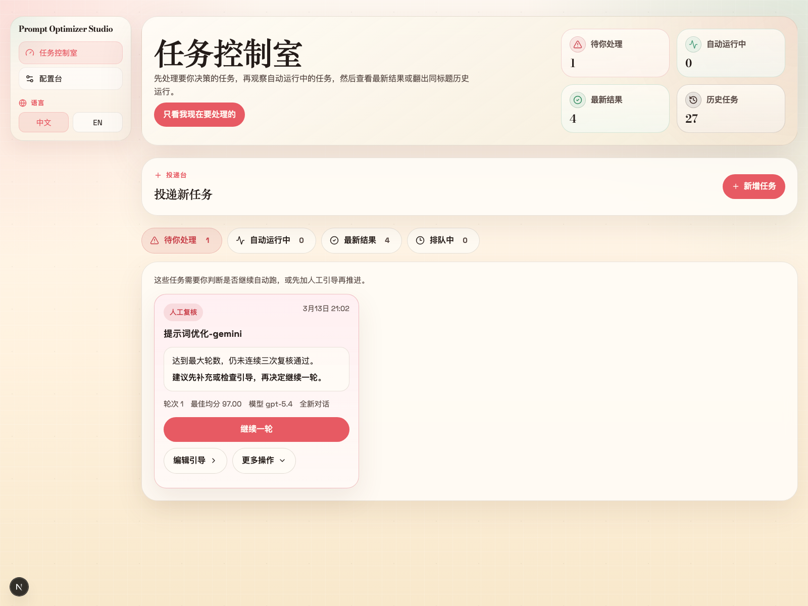
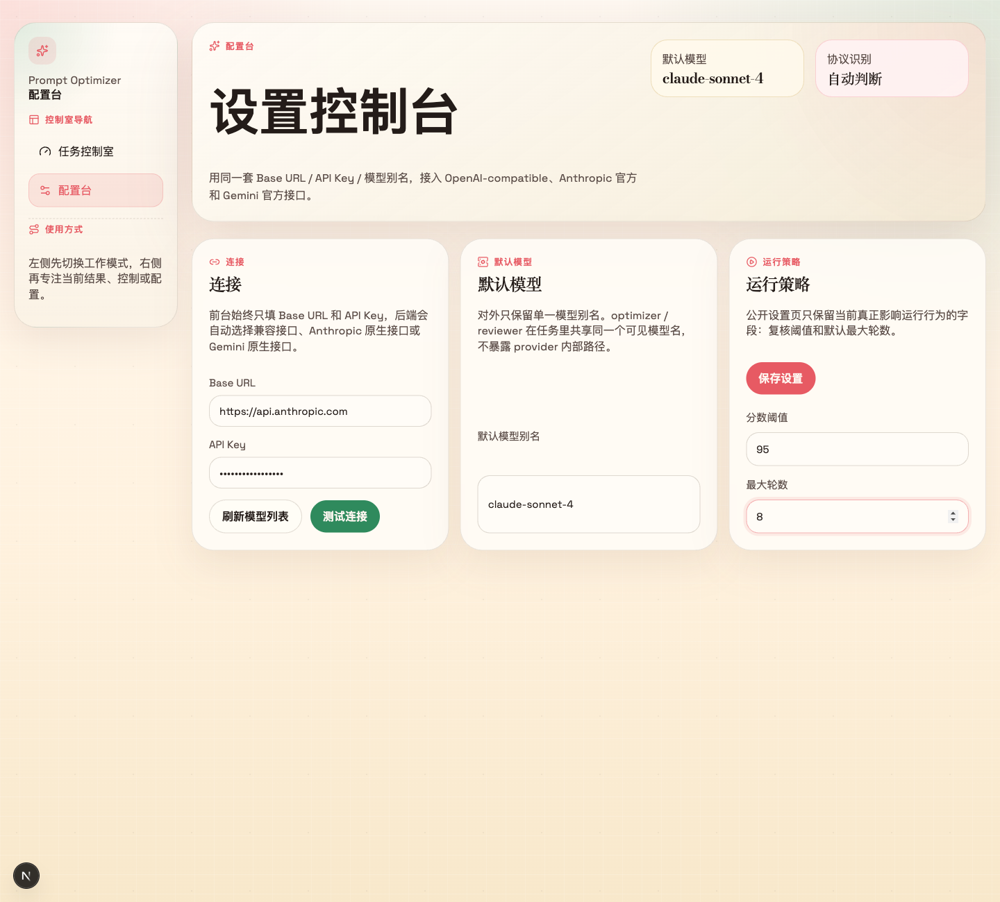

# Prompt Optimizer Studio

A self-hosted prompt optimization studio that keeps the latest copy-ready full prompt front and center, while still letting the operator pause, steer, step one round, or resume auto.

一个自托管的提示词优化工作台：把最新、可直接复制的完整提示词始终放在最前面，同时保留暂停、人工引导、继续一轮与恢复自动运行这些关键控制能力。

<p align="center">
  <a href="https://img.shields.io/github/v/release/XBigRoad/prompt-optimizer-studio?display_name=tag&style=flat-square"></a>
  <a href="https://img.shields.io/badge/edition-self--hosted-2d6a4f?style=flat-square"></a>
  <a href="https://img.shields.io/badge/storage-local%20SQLite-52796f?style=flat-square"></a>
  <a href="https://img.shields.io/badge/providers-OpenAI%20compatible%20%7C%20Anthropic%20%7C%20Gemini-f4a261?style=flat-square"></a>
  <a href="LICENSE"></a>
</p>

<p align="center">
  Final-prompt-first · Human steering between rounds · Base URL / API Key / model alias UX · Docker-friendly self-hosting
  <br />
  完整提示词优先 · 支持中途人工纠偏 · 统一 Base URL / API Key / 模型别名输入 · 适合 Docker 自托管
</p>

<p align="center">
  <a href="https://github.com/XBigRoad/prompt-optimizer-studio/releases/tag/v0.1.0">First Release</a> ·
  <a href="docs/deployment/docker-self-hosted.md">Docker Guide</a> ·
  <a href="CONTRIBUTING.md">Contributing</a> ·
  <a href="#screenshots">Screenshots</a> ·
  <a href="#quick-start">Quick Start</a> ·
  <a href="#english">English</a> ·
  <a href="#中文">中文</a>
</p>

> Release shape: `Self-Hosted / Server Edition` today. A separate `Web Local Edition` is planned later.
> 
> 当前发布形态：`Self-Hosted / Server Edition（自托管服务端版）`。`Web Local Edition` 会作为独立产品形态后续推进。

## At A Glance

| Final Prompt First | Human Steering | Broad Provider Support | Self-Hosted by Default |
| --- | --- | --- | --- |
| Copy the latest full prompt at any time.<br />随时复制当前最新完整提示词。 | Pause, guide the next round, continue one round, or resume auto.<br />暂停、插入下一轮引导、继续一轮，或恢复自动运行。 | `Base URL` + `API Key` + model alias in the UI; the backend routes OpenAI-compatible, Anthropic, and Gemini protocols.<br />前台统一输入，后端自动路由 OpenAI-compatible、Anthropic 与 Gemini 协议。 | Local SQLite, Docker deployment, `/api/health`, and no provider-internal route exposure.<br />本地 SQLite、Docker 部署、自带健康检查，并且不暴露 provider 内部路径。 |

## Start Here

- `Local dev / 本地开发`: `npm install && npm run dev`
- `Docker self-hosted / Docker 自托管`: `cp .env.example .env && docker compose up -d --build`
- `Release notes / 发布说明`: [`v0.1.0 - Self-Hosted Control Room`](https://github.com/XBigRoad/prompt-optimizer-studio/releases/tag/v0.1.0)
- `Deployment doc / 部署文档`: [`docs/deployment/docker-self-hosted.md`](docs/deployment/docker-self-hosted.md)

## Screenshots

Current UI captured from local demo data generated with `npm run demo:seed`.

| Control Room | Result Desk | Config Desk |
| --- | --- | --- |
|  |  |  |

---

## English

### What It Is

`Prompt Optimizer Studio` is a local-first web app for running iterative prompt optimization jobs with explicit operator control.

It keeps the **latest full prompt** as the main artifact, then gives the operator the controls that matter: pause, add next-round steering, continue exactly one round, resume auto, or override max rounds per task.

### Why This Exists

Most prompt optimizers fail in two familiar ways:

- they drift away from the original intent
- they expose internal diffs instead of a final prompt you can directly use

This project is built to keep the result copyable and the optimization loop steerable.

### Core Capabilities

- **Final full prompt, not patch fragments**
  - The Result Desk keeps the latest complete prompt as the primary output.
- **Human steering with explicit run controls**
  - Pause, inject next-round guidance, continue one round, resume auto, or cap a task with max-round override.
- **Drift guard with a small optimizer context**
  - The system keeps a compact `goalAnchor` and sends only the current prompt, slim patch, and current steering batch to the optimizer.
- **Independent reviewer isolation**
  - The reviewer sees the current candidate and scoring rules, not historical aggregate issue lists or steering raw text.
- **Broad provider compatibility without route leakage**
  - The UI stays on `Base URL` + `API Key` + model alias while the backend selects OpenAI-compatible, Anthropic native, or Gemini native protocols.

### How It Works

1. Create a task from a raw prompt or an existing draft.
2. The system derives a compact `goalAnchor`.
3. The optimizer produces a revised **full prompt**.
4. The reviewer scores the current candidate independently.
5. The operator can pause, steer, step one round, or resume automatic execution while the latest full prompt stays copyable.

### Product Shape

- **Control Room**: tasks that need action, active runs, recent results, and searchable history.
- **Result Desk**: the latest full prompt first, then goal understanding, controls, and diagnostics.
- **Config Desk**: connection setup, model defaults, and the runtime controls that are actually active today.

### Tech Stack

- `Next.js 16`
- `React 19`
- `TypeScript`
- `SQLite` via `node:sqlite`
- `framer-motion`
- `lucide-react`

### Quick Start

#### Prerequisites

- `Node 22.22.x`
- `npm`

#### Install

```bash
npm install
```

#### Start Development Server

```bash
npm run dev
```

Then open:

```text
http://localhost:3000
```

#### Verify Everything

```bash
npm run check
```

#### Run With Docker

```bash
cp .env.example .env
docker compose up -d --build
```

Then open:

```text
http://localhost:3000
```

Optional health check:

```bash
curl http://localhost:3000/api/health
```

Docker stores the SQLite database in `/app/data/prompt-optimizer.db` inside the container, backed by the named Compose volume by default.

For the full self-hosted Docker guide, see `docs/deployment/docker-self-hosted.md`.

### Configuration

The app is configured from the **Config Desk**.

The UI stays intentionally simple:

- `Base URL`
- `API Key`
- default task model alias
- active runtime controls: `scoreThreshold` and `maxRounds`

The backend infers the wire protocol from `Base URL`, so the UI does not expose provider-specific route details.

Supported today:

- **OpenAI-compatible** endpoints using `GET /models` and `POST /chat/completions`
- **Anthropic official API** using `GET /v1/models` and `POST /v1/messages`
- **Gemini official API** using `GET /v1beta/models` and `POST /v1beta/models/{model}:generateContent`

Common `Base URL` examples:

- `https://api.openai.com/v1`
- `https://api.anthropic.com`
- `https://generativelanguage.googleapis.com`

For official APIs, `Base URL` can be the provider's own root. It does not need to be a custom proxy path.

### Deployment Model

This repository currently ships the **Self-Hosted / Server Edition**.

- Local `npm` runs store data on the machine running the app.
- Docker deployments store data in the mounted server-side volume, not in each user browser.
- Server-originated requests remain the broadest compatibility path for OpenAI-compatible endpoints.
- A separate hosted `Web Local Edition` is planned later, but it is not shipped in this repository today.

### Storage (Current Self-Hosted Edition)

By default, the local SQLite database is stored at:

```text
data/prompt-optimizer.db
```

You can override it with:

```bash
PROMPT_OPTIMIZER_DB_PATH=/your/custom/path.db
```

The Docker Compose setup defaults to:

```text
/app/data/prompt-optimizer.db
```

That file lives inside the container but persists through the named Docker volume mounted at `/app/data`.

### Operator Controls

At the task level, the app supports:

- `Pause`
- `Continue One Round`
- `Resume Auto`
- `Retry`
- `Cancel`
- `Next-Round Steering`
- `Max Rounds Override`

### FAQ

- **Is this a hosted SaaS?**
  - No. This repository currently ships the **Self-Hosted / Server Edition**.
- **Where is data stored?**
  - In the SQLite database on the machine or mounted volume running the app.
- **Which APIs does it support?**
  - The UI stays on `Base URL` + `API Key` + model alias, while the backend supports OpenAI-compatible, Anthropic official, and Gemini official APIs.
- **Do official APIs work without a custom proxy URL?**
  - Yes. Put the provider's official root into `Base URL`, and the backend will choose the right protocol automatically.
- **Can I intervene during optimization?**
  - Yes. You can pause a task, add next-round steering, continue exactly one round, or resume automatic execution.
- **Who is this for?**
  - Teams and individual operators who want iterative prompt refinement without hiding the final usable prompt.
- **Why use AGPL-3.0?**
  - Because modified hosted versions should stay source-available to the users who rely on them.

### Design Principles

- **Control before automation**
- **Full prompt before internal diff**
- **Small context before bloated history**
- **Operator clarity before provider complexity**

### Current Notes

- Newer builds include a worker-lease fix that prevents the same running job from being claimed multiple times.
- If an old local database already contains duplicate round numbers from pre-fix builds, those historical records may still appear until cleaned up.

### Roadmap

- Legacy duplicate-round cleanup
- Future `Web Local Edition`
- Better prompt-pack management
- Richer result comparison and safer import/export

### Project Status

Active development.

### Contributing And Security

- Contribution guide: [`/CONTRIBUTING.md`](CONTRIBUTING.md)
- Security policy: [`/SECURITY.md`](SECURITY.md)

### License

This project is released under the `AGPL-3.0-only` License. In plain language:

- you can use, study, modify, and self-host it
- if you distribute a modified version, or run a modified version for other users over a network, you must provide the corresponding source code under AGPL as well
- see `/LICENSE` for the full license text

---

## 中文

### 它是什么

`Prompt Optimizer Studio` 是一个本地优先的提示词优化工作台，用来运行可控的多轮优化任务。

它把**当前最新完整提示词**作为主交付物，然后给操作者保留真正关键的控制能力：暂停、补充下一轮引导、只继续一轮、恢复自动运行，以及按任务覆盖最大轮数。

### 为什么要做它

大多数 prompt optimizer 最后会出两个典型问题：

- 自动优化越跑越偏，逐渐背离最初意图
- 只暴露内部 diff，却不给你一个可以直接复制使用的最终提示词

这个项目就是为了解决这两件事：既保证结果可直接使用，也保证优化过程可人工纠偏。

### 核心能力

- **最终完整提示词优先，而不是只给 patch**
  - 结果台始终把最新完整 prompt 放在第一位。
- **人工引导配合明确运行控制**
  - 你可以暂停、补充下一轮引导、继续一轮、恢复自动运行，或覆盖任务最大轮数。
- **目标防漂移，同时保持 optimizer 轻上下文**
  - 系统通过紧凑的 `goalAnchor` 约束方向，并且只把当前 prompt、精简 patch、当前引导批次交给 optimizer。
- **reviewer 隔离清晰**
  - reviewer 只看当前候选稿和评分规则，不看历史聚合问题，也看不到人工引导原文。
- **多协议接入，但不暴露底层路由细节**
  - 前台始终是 `Base URL` + `API Key` + 模型别名，后端自动选择 OpenAI-compatible、Anthropic 原生或 Gemini 原生协议。

### 工作方式

1. 从原始提示词或已有草稿创建任务。
2. 系统先提炼一个紧凑的 `goalAnchor`。
3. optimizer 输出新的**完整提示词**。
4. reviewer 独立对当前候选稿打分和复核。
5. 操作者可以暂停、插入引导、只推进一轮，或恢复自动运行，同时始终保留可复制的最新完整 prompt。

### 产品结构

- **任务控制室**：需要你处理的任务、自动运行中的任务、最新结果与可搜索的历史任务。
- **结果台**：先看最新完整提示词，再看目标理解、控制区和诊断区。
- **配置台**：连接配置、模型默认值，以及当前真正生效的运行控制。

### 技术栈

- `Next.js 16`
- `React 19`
- `TypeScript`
- `SQLite`（基于 `node:sqlite`）
- `framer-motion`
- `lucide-react`

### 快速开始

#### 环境要求

- `Node 22.22.x`
- `npm`

#### 安装依赖

```bash
npm install
```

#### 启动开发环境

```bash
npm run dev
```

然后打开：

```text
http://localhost:3000
```

#### 完整检查

```bash
npm run check
```

#### 使用 Docker 启动

```bash
cp .env.example .env
docker compose up -d --build
```

然后打开：

```text
http://localhost:3000
```

可选健康检查：

```bash
curl http://localhost:3000/api/health
```

Docker 默认会把 SQLite 数据库存到容器内的 `/app/data/prompt-optimizer.db`，并通过 Compose 的命名卷持久化。

完整 Docker 自托管说明见 `docs/deployment/docker-self-hosted.md`。

### 配置方式

应用通过**配置台**完成配置。

前台保持为一套统一输入：

- `Base URL`
- `API Key`
- 默认任务模型别名
- 当前实际生效的运行项：`scoreThreshold` 与 `maxRounds`

后端会根据 `Base URL` 自动判断底层协议，因此前台不会暴露 provider 专用路径。

当前支持：

- **OpenAI-compatible**：`GET /models` + `POST /chat/completions`
- **Anthropic 官方 API**：`GET /v1/models` + `POST /v1/messages`
- **Gemini 官方 API**：`GET /v1beta/models` + `POST /v1beta/models/{model}:generateContent`

常见 `Base URL` 示例：

- `https://api.openai.com/v1`
- `https://api.anthropic.com`
- `https://generativelanguage.googleapis.com`

如果你接的是官方 API，`Base URL` 直接填写官方根地址即可，不需要额外自建代理路径。

### 发布形态

当前这个仓库发布的是 **Self-Hosted / Server Edition（自托管服务端版）**。

- 本地 `npm` 运行时，数据保存在运行应用的机器上。
- Docker 自托管时，数据保存在服务端挂载卷中，而不是每个用户自己的浏览器里。
- 由服务端发起请求，仍然是兼容 OpenAI-compatible Base URL 最广的一种形态。
- `Web Local Edition` 会作为另一种独立产品形态后续推进，但当前仓库并未交付它。

### 数据存储（当前自托管版）

默认 SQLite 数据库位置：

```text
data/prompt-optimizer.db
```

也可以通过下面的环境变量覆盖：

```bash
PROMPT_OPTIMIZER_DB_PATH=/your/custom/path.db
```

Docker Compose 默认会把数据库放在：

```text
/app/data/prompt-optimizer.db
```

这个文件位于容器内部，但会通过挂载到 `/app/data` 的命名卷持续保留。

### 任务控制能力

任务级支持：

- `暂停`
- `继续一轮`
- `恢复自动运行`
- `重试`
- `取消`
- `下一轮人工引导`
- `最大轮数覆盖`

### FAQ

- **这是一个官方在线 SaaS 吗？**
  - 不是。当前仓库发布的是 **Self-Hosted / Server Edition（自托管服务端版）**。
- **数据存在哪里？**
  - 存在运行这套应用的机器或挂载卷里的 SQLite 数据库中。
- **支持哪些 API / 模型接入？**
  - 前台仍然只填 `Base URL`、`API Key` 和模型别名，后端支持 OpenAI-compatible、Anthropic 官方 API 和 Gemini 官方 API。
- **如果是各家官方 API，没有自定义 Base URL 也能用吗？**
  - 可以。把官方根地址直接填进 `Base URL` 即可，后端会自动选择对应协议。
- **优化过程中可以人工干预吗？**
  - 可以。你可以暂停任务、补充下一轮人工引导、只继续一轮，或者恢复自动运行。
- **适合谁使用？**
  - 适合那些想做多轮提示词优化、但又不想失去人工控制权的个人和团队。
- **为什么改用 AGPL-3.0？**
  - 因为这个项目希望即使被别人改成在线服务继续对外提供，也要保持对应修改源码可获得。

### 设计原则

- **控制优先于自动化**
- **完整提示词优先于内部 diff**
- **轻上下文优先于长历史回灌**
- **用户可理解优先于 provider 复杂度暴露**

### 当前说明

- 新版本已经加入 worker 租约修复，避免同一个运行中任务被重复 claim。
- 如果旧的本地数据库里已经残留了修复前产生的重复轮号，这些历史记录仍可能继续显示，直到后续完成数据清洗。

### 路线图

- 清理历史遗留的重复轮号数据
- 未来 `Web Local Edition`
- 更好的 prompt pack 管理能力
- 更丰富的结果对比与更安全的导入导出

### 项目状态

持续开发中。

### 参与贡献与安全

- 贡献说明：[`/CONTRIBUTING.md`](CONTRIBUTING.md)
- 安全策略：[`/SECURITY.md`](SECURITY.md)

### 许可证

本项目采用 `AGPL-3.0-only` 许可证。用人话来说：

- 你可以自由使用、研究、修改和自托管
- 如果你分发修改版，或者把修改版作为在线服务提供给其他用户使用，就需要按 AGPL 提供对应源码
- 完整条款见 `/LICENSE`
